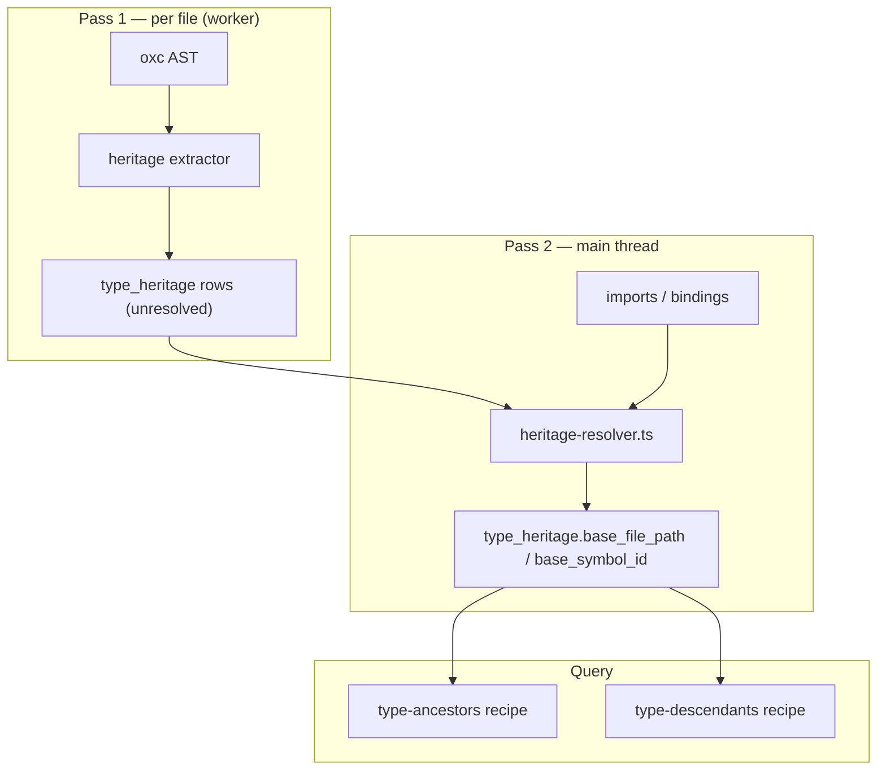

# Type heritage substrate — plan

> **Status:** open · **Priority:** P2 (substrate) · **Effort:** M (~2–3 weeks, 4 tracer-bullet PRs)
>
> **Motivator:** [`type-ancestors` / `type-descendants`](../templates/recipes/type-ancestors.md) recipes shipped in [#141](https://github.com/stainless-code/codemap/pull/141) by re-parsing `symbols.signature` in SQL. That tracer bullet works for same-file hierarchies but documents hard limits: qualified extends, comma-in-generics multi-base splits, and name-only homonym resolution. Lifting all limits requires **indexed heritage rows** populated from the oxc AST at parse time, then rewiring recipes to JOIN — not smarter string parsing.
>
> **Roadmap:** [§ Backlog — Core substrate & platform](../roadmap.md#core-substrate--platform)
>
> **Shipped v1 (keep):** bundled recipes + goldens in `templates/recipes/type-ancestors.{sql,md}`, `type-descendants.{sql,md}`; fixture `fixtures/minimal/src/types/hierarchy.ts`. v1 recipes remain the fallback query surface until substrate lands; then SQL simplifies in-place (same recipe ids).

---

## Limits today → substrate fix

| Limit (recipe `.md` bodies)                                    | Root cause today                                                                                   | Lift                                                                               |
| -------------------------------------------------------------- | -------------------------------------------------------------------------------------------------- | ---------------------------------------------------------------------------------- |
| Qualified extends (`extends pkg.Type`) may miss                | Extractor stores unqualified names only (`superClass?.name`, `e.expression?.name`) in `symbols.ts` | AST walk emits `qualified_name` + optional resolved `base_file_path`               |
| Commas inside generic args mis-split multi-base `extends A, B` | Recipe splits signature on `', '`                                                                  | One **row per base** at index time from `node.extends[]` / `implements[]`          |
| Homonyms fan out / need `file_path` heuristics                 | Edges keyed by bare `base_name`                                                                    | Resolve base to `(name, file_path)` or `resolved_symbol_id` via imports + bindings |
| `extends A,B` (no space) not split                             | Same signature split                                                                               | AST array — N/A once substrate exists                                              |
| Cross-module unqualified extends ambiguous                     | No import-aware heritage                                                                           | Post-index resolve pass (same pattern as `bindings-engine`)                        |

**Not a “limit” to lift in v2:** direct `implements` is depth-1 only (transitive interface inheritance is a separate product decision — keep unless a consumer asks).

---

## Pre-locked decisions

| #   | Decision                                                                                                                                                                                                                   | Source                                                                                   |
| --- | -------------------------------------------------------------------------------------------------------------------------------------------------------------------------------------------------------------------------- | ---------------------------------------------------------------------------------------- |
| L.1 | **New table `type_heritage`** — one row per `(child symbol, base, relation)` edge. No verdict columns.                                                                                                                     | [Moat B](../roadmap.md#moats-load-bearing)                                               |
| L.2 | **Recipes keep same ids** — `type-ancestors` / `type-descendants` SQL rewired to JOIN `type_heritage`; delete signature-parsing CTEs + `templates/recipes-fragments/heritage-edges.sql`.                                   | [Moat A](../roadmap.md#moats-load-bearing)                                               |
| L.3 | **Single-pass extract** in oxc visitor (extend `symbols.ts` or new `src/extractors/heritage.ts`).                                                                                                                          | [`substrate-extraction.md` R.1](./substrate-extraction.md#pre-locked-decisions)          |
| L.4 | **Two-phase index:** (1) per-file insert heritage rows with `resolution_kind`; (2) main-thread resolve pass maps unqualified bases → `base_file_path` / `base_symbol_id` using `imports`, `import_specifiers`, `bindings`. | Mirrors [`substrate-extraction.md` R.12](./substrate-extraction.md#pre-locked-decisions) |
| L.5 | **`resolution_kind` enum:** `same-file` \| `imported` \| `qualified-unresolved` \| `unresolved` — honest gaps, no silent guess beyond import graph.                                                                        | Same vocabulary as `bindings.resolution_kind`                                            |
| L.6 | **No JS at index time** — static AST + import table only; no typechecker.                                                                                                                                                  | [Floors](../roadmap.md#floors-v1-product-shape)                                          |
| L.7 | **SCHEMA_VERSION bump** + full rebuild on upgrade; user-data tables unchanged.                                                                                                                                             | [`substrate-extraction.md` R.16](./substrate-extraction.md#pre-locked-decisions)         |
| L.8 | **Every PR ships extractor tests + ≥1 golden** exercising new resolution paths.                                                                                                                                            | [`substrate-extraction.md` R.18](./substrate-extraction.md#pre-locked-decisions)         |

---

## Open decisions

| #   | Question                                                                                                   | Default if unset                                                                                |
| --- | ---------------------------------------------------------------------------------------------------------- | ----------------------------------------------------------------------------------------------- |
| Q.1 | Store **`base_symbol_id`** (FK → `symbols.id`) vs only `(base_name, base_file_path)`?                      | Both: `base_symbol_id` nullable until resolve pass; recipes JOIN on id when set, else name+path |
| Q.2 | **`qualified_name` text** column (`pkg.Type`) vs normalize into `import_specifiers` link only?             | Keep `qualified_name` text for audit/debug recipes                                              |
| Q.3 | Type-only extends (`class Foo extends Bar<string>`) — heritage row uses **`Bar` or full generic display?** | Simple name for graph walks; optional `type_args` JSON for display recipes                      |
| Q.4 | Incremental `--files` — re-resolve heritage touching changed files only?                                   | Yes (same scoped resolve as bindings)                                                           |

---

## Schema sketch

```sql
CREATE TABLE type_heritage (
  id INTEGER PRIMARY KEY AUTOINCREMENT,
  child_file_path TEXT NOT NULL REFERENCES files(path) ON DELETE CASCADE,
  child_name TEXT NOT NULL,
  child_kind TEXT NOT NULL,
  child_line_start INTEGER NOT NULL,
  relation TEXT NOT NULL CHECK (relation IN ('extends', 'implements')),
  base_simple_name TEXT NOT NULL,
  base_qualified_name TEXT,
  base_file_path TEXT,
  base_symbol_id INTEGER REFERENCES symbols(id) ON DELETE SET NULL,
  resolution_kind TEXT NOT NULL CHECK (
    resolution_kind IN ('same-file', 'imported', 'qualified-unresolved', 'unresolved')
  ),
  type_args TEXT
) STRICT;

CREATE INDEX idx_type_heritage_child ON type_heritage(child_file_path, child_name, relation);
CREATE INDEX idx_type_heritage_base ON type_heritage(base_simple_name, base_file_path);
CREATE INDEX idx_type_heritage_base_symbol ON type_heritage(base_symbol_id);
```

`type_members` stays for interface **members** — not heritage (prior plan confusion).

---

## Architecture



Primitive sources: [oxc AST class/interface nodes](https://oxc.rs/docs/guide/usage/parser.html); resolution pattern mirrors existing `bindings-engine` + `resolver.ts` (not peer-tool cloning).

---

## Implementation steps (tracer bullets)

### PR 1 — Schema + extract (unresolved rows)

1. `SCHEMA_VERSION` bump + DDL + insert/delete in `db.ts` (file-scoped cascade on reindex).
2. **`src/extractors/heritage.ts`** — from `TSInterfaceDeclaration.extends`, `ClassDeclaration.superClass` + `implements`:
   - Handle `TSQualifiedName` / `MemberExpression` → `base_qualified_name`
   - Handle `superClass` when not `.name` (qualified)
   - One row per base in AST arrays (fixes comma-in-generics)
3. Wire into `parse-worker-core` / `parser.ts` bulk insert path.
4. **`src/extractors/heritage.test.ts`** — qualified extends, multi-base, implements.
5. Fixture: `fixtures/minimal/src/types/heritage-qualified.ts` (minimal rows, no resolve yet).

**Acceptance:** `SELECT * FROM type_heritage WHERE child_name = '…'` returns correct row count; goldens optional (substrate-only).

### PR 2 — Resolve pass

1. **`src/application/heritage-resolver.ts`** — batch after bindings resolve:
   - Unqualified base in file → `same-file` if symbol defined in `child_file_path`
   - Else match `imports` + `import_specifiers` → `imported` + `base_file_path`
   - Qualified → `qualified-unresolved` until Q.1 cross-module map exists; v2.1 may add namespace/package map
2. Wire in `index-engine.ts` (full + incremental `--files` scope per Q.4).
3. Extend fixtures: cross-file `extends` via import (`hierarchy.ts` + imported base).
4. Golden: raw SQL or interim recipe `type-heritage-edges` (optional debug recipe).

**Acceptance:** `Dog → Mammal → Animal` resolves with correct `base_file_path`; homonym file does not cross-wire.

### PR 3 — Rewire recipes + delete fragment

1. Replace `type-ancestors.sql` / `type-descendants.sql` CTEs with recursive walks on `type_heritage` (join `symbols` for display columns).
2. Delete `templates/recipes-fragments/heritage-edges.sql`.
3. Slim recipe `.md` — remove “Limits (signature-derived)” section; document `resolution_kind` gaps only.
4. Update all existing type-\* goldens; add:
   - qualified extends chain
   - `interface Both extends A, Map<string, Animal>` (generic comma)
   - cross-file import base
5. Keep `file_path` / `kind` / `max_depth` params (still useful for start-symbol disambiguation).

**Acceptance:** All prior goldens pass; new goldens cover former limits; `bun run test:golden` green.

### PR 4 — Docs + catalog

1. Row in [`architecture.md § Schema`](../architecture.md#schema) for `type_heritage`.
2. Glossary entry: **Type heritage** / **Heritage edge** (if term recurs in recipes).
3. MCP instructions unchanged (same recipe ids).
4. Delete this plan + lift any unique ops detail to `architecture.md` when merged.

---

## Acceptance (plan close)

- [ ] No signature parsing in `type-ancestors` / `type-descendants` SQL
- [ ] Qualified extends, multi-base with generics, and homonym cases covered by goldens
- [ ] Incremental reindex updates heritage for touched files without full rebuild
- [ ] Recipe `.md` bodies no longer list signature-parsing limits
- [ ] `templates/recipes-fragments/heritage-edges.sql` removed

---

## Dependencies

| Dependency                                                                        | Relationship                                                 |
| --------------------------------------------------------------------------------- | ------------------------------------------------------------ |
| [#141](https://github.com/stainless-code/codemap/pull/141) type hierarchy recipes | v1 shipped; this plan supersedes signature approach          |
| [`substrate-extraction.md`](./substrate-extraction.md) tiers 1–6                  | `bindings` + `imports` must be populated (shipped SCHEMA 34) |
| [`unresolved-calls-staging.md`](./unresolved-calls-staging.md)                    | Independent; shared “two-phase resolve” pattern              |
| oxc class/interface AST                                                           | Extraction source — cite node shapes in PR 1                 |

---

## What's NOT in scope

- Full TypeScript typechecker / type-only heritage (`extends string` on generics)
- Transitive `implements` walks (unless Q reopened with consumer)
- MCP `trace`-style wrapper for type hierarchy (recipes-only per v1 decision)
- **`type_members` backfill** for heritage — wrong table

---

## Capability unlock (Moat B)

After ship, recipes and ad-hoc SQL can express:

- “All classes implementing `Pet` **imported from** `./types`”
- “Types extending `Map<string, T>`” (via `type_args` or dedicated filter)
- “Unresolved heritage edges” (`resolution_kind = 'unresolved'`) for agent diagnostics
- Future: `rename-preview` / apply-engine rows keyed on resolved `base_symbol_id`
